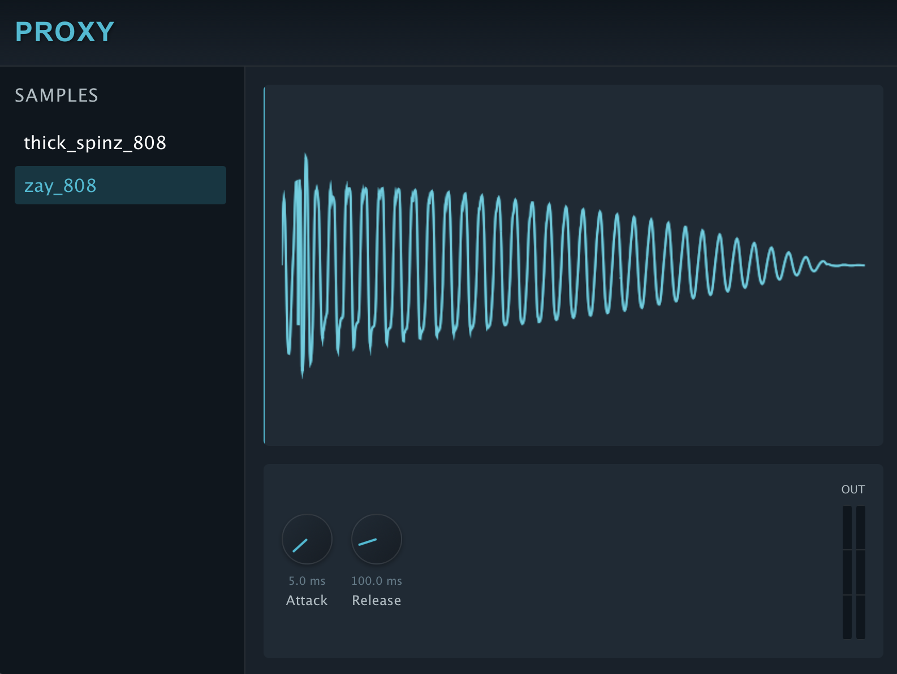

# Proxy Sampler

A modern sample-based instrument VST3 plugin built with JUCE 8.



## Features

- Sample-based playback with pitch shifting based on MIDI notes
- Sample browser with ability to load custom samples
- Adjustable attack and release parameters
- Real-time waveform visualization with playback position
- Input/Output level metering

## Build & Installation

1. After cloning the repository, initialize and update the JUCE submodule:

   ```
   git submodule add https://github.com/juce-framework/JUCE.git
   git submodule update --init --recursive
   ```

2. Build the project:

   ```
   cmake -B build
   cmake --build build
   ```

3. The plugin should automatically be copied to your system's VST folder:
   - Windows: `C:\Program Files\Common Files\VST3`
   - macOS: `~/Library/Audio/Plug-Ins/VST3`
   - Linux: `~/.vst3`

## Usage

1. Load the plugin in your DAW of choice that supports VST3 plugins
2. The default sample (zay_808.wav) is loaded on startup
3. Use the sample browser on the left to select different samples
4. Add custom samples by clicking the "+ Add Sample" button
5. Play MIDI notes to trigger the sample at different pitches
6. Adjust attack, release, and gain parameters as needed

## Project Structure

- `src/core`: Core plugin processor and editor classes
- `src/dsp/sampler`: Sampler engine and sample library management
- `src/resources`: HTML/CSS UI and sample files
- `src/ui`: UI components and layout management

## Development

This project uses modern C++17 features and follows JUCE 8 practices. The UI is built with a WebView component using HTML/CSS for flexibility and ease of styling.

To add more features:

1. Add new samples to `src/resources/samples/`
2. Update the CMakeLists.txt to include the new sample files
3. Rebuild the project
# Proxy-VST
